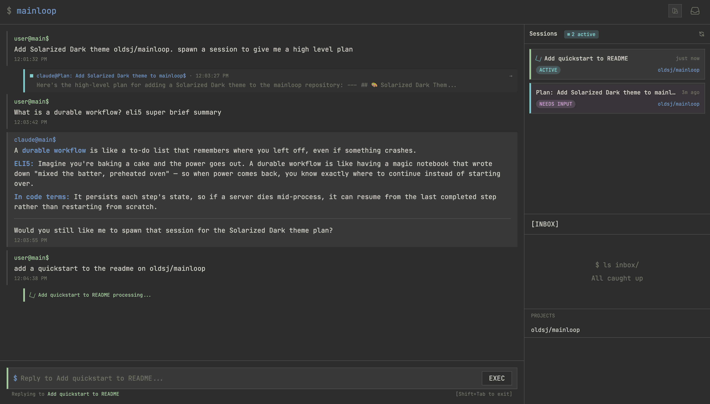

# mainloop

A single conversation to manage all of your AI sessions - that keeps working while you're away.

Your main conversation thread is the closest digital mapping to your own internal thread of consciousness. Everything else flows into a unified inbox that surfaces only what needs your attention.

Inspired by [You Are The Main Thread](https://claudelog.com/mechanics/you-are-the-main-thread/) — you are the bottleneck, so spawn parallel AI sessions and let them handle the work while you stay in flow.

| Desktop                                                                  | Mobile                                                                                                                          |
| ------------------------------------------------------------------------ | ------------------------------------------------------------------------------------------------------------------------------- |
|  |  |

## How It Works

```text
You (phone/laptop)
    │
    ▼
┌─────────────────────────────────────────────────────┐
│                   Main Thread                        │
│       Native Claude Code session in Substrate        │
│                                                      │
│   user@mainloop$ research X      ← inline sessions  │
│   ├── [research X] thinking...   ← threaded reply   │
│   └── [research X] here's what   ← notification     │
└──────────────┬────────────────┬─────────────────────┘
               │                │
       ┌───────▼──────┐  ┌──────▼───────┐
       │   Session 1  │  │   Session 2  │  ...
       │   (Claude)   │  │   (Opus)     │
       │              │  │              │
       │   Research   │  │  Feature dev │
       └──────────────┘  └──────────────┘
```

- **Main thread**: One continuous native conversation; delegated sessions surface results back
- **Sessions**: Native Claude Code or Codex work with their own conversations; appear as colored threads in your timeline
- **Notifications**: Slack-style thread replies notify you when sessions need attention or complete
- **Persistence**: Mainloop stores conversations, delivery records, and workspace lifecycle state in PostgreSQL; native history remains with the provider CLI in Substrate

## Quick Start

```bash
# Copy example environment file and configure
cp .env.example .env
# Set the Substrate router, actor bindings, and shim Secret names.
# Keep provider credentials in Mainloop's configured control-plane Secrets; actors receive synthetic placeholders only.

# Start all services
make dev

# Frontend: http://localhost:3000
# Backend:  http://localhost:8000/docs
```

## Production Deployment

The Kubernetes manifests under `k8s/apps/mainloop/` provide reusable bases and example overlays. Supply environment-specific images, domains, credentials, and storage through your deployment configuration, and apply production changes through your GitOps workflow.

## Project Structure

```text
mainloop/
├── backend/       # Python FastAPI + DBOS workflows
├── frontend/      # SvelteKit + Tailwind v4 (mobile-first responsive)
├── models/        # Shared Pydantic models
├── packages/ui/   # Design tokens + theme.css
└── k8s/           # Kubernetes manifests
```

## UI

- **Mobile**: Bottom tab bar (Chat / Sessions)
- **Desktop**: Chat with always-visible Sessions sidebar

**Chat** — your main thread with inline sessions:

- Sessions spawn as colored thread blocks in your timeline
- Session messages appear as Slack-style thread notifications
- Click to expand inline or zoom to fullscreen view
- Terminal-style prompt: `user@context$` with content on new line

**Sessions** — all background work in one place:

1. Active sessions (with live status)
2. Sessions needing input (questions, plan reviews)
3. Completed and failed sessions
4. Each session has its own conversation you can zoom into

## Agent Workflow

Agents are native sessions spawned for development tasks. Mainloop records the session and its deliveries; the native CLI runs in the Substrate actor selected by the configured provider binding.

```text
┌─────────────┐     ┌─────────────┐     ┌─────────────┐     ┌─────────────┐
│   Spawn     │────►│    Work     │────►│     PR      │────►│    Close    │
│   (main)    │     │(Substrate) │     │  (GitHub)   │     │  (summary)  │
└─────────────┘     └─────────────┘     └─────────────┘     └─────────────┘
       ▲                   │
       └───────────────────┘
         check in / spawn more
```

1. **Spawn** - Main thread creates agent for a task
2. **Work** - A native Claude Code or Codex session runs in its configured Substrate actor
3. **PR** - Agent creates and merges GitHub PR when ready
4. **Close** - Agent posts summary back to main thread

You stay in main thread, checking in on agents and spawning new ones as needed.

## Documentation

**Specs** (source of truth for app behavior):

- [Chat](docs/specs/chat.md) - Main thread conversation
- [Sessions](docs/specs/sessions.md) - Background work and status
- [Layout](docs/specs/layout.md) - Mobile and desktop views

**Guides**:

- [Architecture](docs/architecture.md) - Substrate workspaces, delivery, previews, and credentials
- [Contributing](CONTRIBUTING.md) - Local setup, development commands, and contribution guidance

## License

This project is licensed under the [Sustainable Use License v1.0](LICENSE.md) - a source-available license that allows free use for internal business, non-commercial, and personal purposes.
