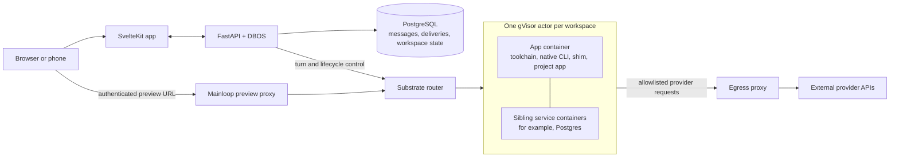
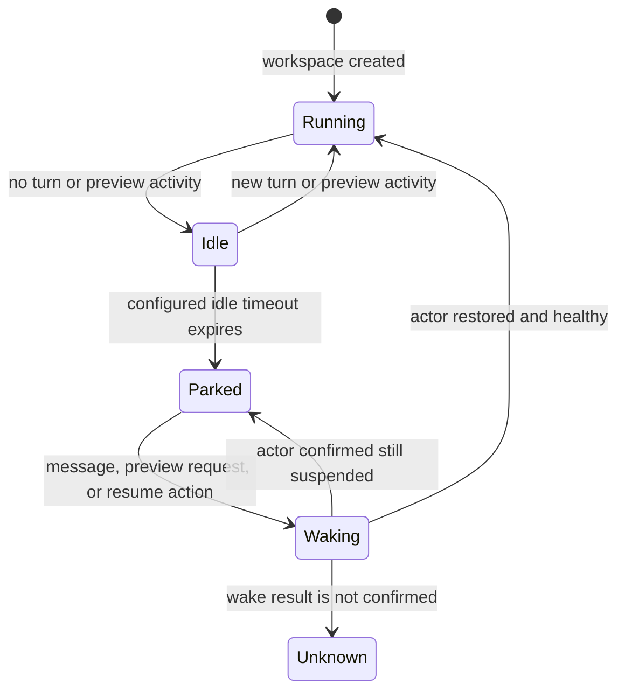
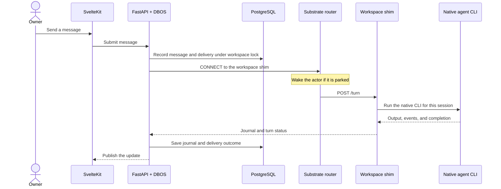
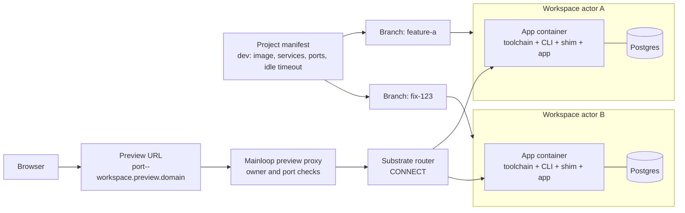
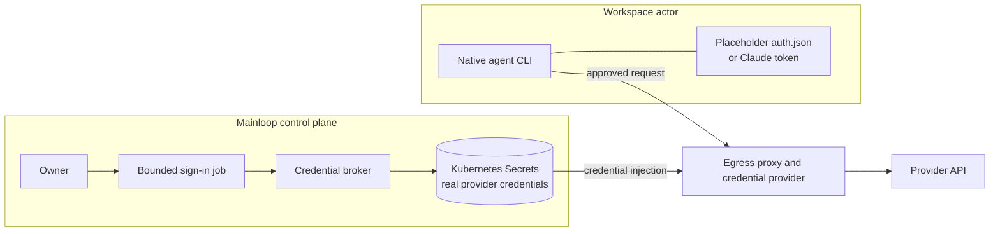

# How Mainloop works

Mainloop keeps project conversations, agent work, and workspace state together. The control
plane stores messages and delivery state; native Claude Code and Codex sessions run in isolated
Substrate workspaces. Mainloop uses attention as a compute budget: active workspaces run, while
inactive workspaces are snapshotted and suspended until needed.

These diagrams describe implemented code paths; they do not claim a live cluster proof. Known
verification gaps are listed below.

## System overview

Mainloop owns conversations, message delivery, workspace policy, and the mapping from native
sessions to workspaces. Substrate runs and snapshots the workspace actors. Agent CLIs keep their
native session identity, history, and tools inside the workspace. The preview proxy checks the
owner and allowed ports before sending traffic through the router.

## Attention and parking

Think of workspace compute like foveated rendering in VR: what needs attention is loaded and
running; the rest is parked. Here, parking means that Substrate snapshots and suspends an actor.
An `idle` workspace is still present in Mainloop; `idle` is the waiting period before suspension,
not a separate Substrate state.

The project `dev` manifest sets the idle timeout; its current default is 30 minutes. Mainloop
checks for expired workspaces about once a minute. Turns and preview requests count as activity.
Opening a workspace page does not wake its actor. Deliveries in `recorded`, `queued`, `sending`,
or `uncertain` states, and deliveries sent without completion, block parking. A new message, turn,
or allowed preview request asks the router to wake a parked actor. The intended interactive wake
is about a second.

Measured locally on Kind in earlier Substrate actor runs: resume took about 0.4–0.8 seconds.
That is an observed actor-resume time, not an end-to-end latency promise. The current headless
native-CLI path and live wake-on-preview path have not been verified on a cluster.

## Sending a message

Recording the delivery before connecting gives Mainloop a stable delivery to reconcile if a
connection times out. Mainloop does not blindly send an uncertain turn again.

## Development workspaces and previews

A project manifest has a `dev` section for the app image or devcontainer, sibling services,
preview ports, and idle timeout. Mainloop creates a separate workspace actor for each branch.
Each actor has an app container with its toolchain, agent CLIs, shim, and app process; declared
services such as Postgres run alongside it in the same actor. Branches have separate app and
service state.

The preview URL is `https://<port>--<workspace>.preview.<domain>`. The preview proxy routes the
requested port to that workspace through the router. It accepts ports declared in the manifest
or reported by the authenticated shim. A preview request is designed to wake a parked workspace,
then serve the app after it is ready.

## Credentials

Actors do not receive the real provider credentials. The credential broker keeps the real
Codex `auth.json` and Claude token in control-plane Secrets. In the actor, Codex gets a synthetic
placeholder `auth.json` and Claude gets a placeholder token. The egress credential provider
injects the broker-owned value into approved provider requests.

When a credential is missing or rejected, Mainloop raises an attention item instead of replaying
the failed turn. The owner can complete a provider sign-in flow from the workspace page. The
Kubernetes sign-in job and the external egress credential-provider contract are not live-verified.

## Isolation and known gaps

- Substrate actors use gVisor isolation. The router admits actor control traffic from the
  Mainloop control namespace; actor shim requests use a distinct token for each actor.
- Actor egress is restricted by host allowlists and passes through the egress proxy.
- Workspace lifecycle and credential paths have fake-backed coverage; their combined behavior
  has not been verified end to end on a live cluster.
- Substrate starts actor containers as UID 0 without `SETUID`/`SETGID`, so the image's drop to
  UID `10001` fails. The entrypoint and shim refuse to continue as root, so agent actors do not
  start on the current version. They need a Substrate runtime that honors a non-root user; this
  is an upstream gap.
- The actor's observed `RLIMIT_NOFILE` is 1024.
- Restoring Postgres from an actor snapshot is unverified.
- Live wake-on-preview is unverified.

## Glossary

| Term                | Meaning                                                                                             |
| ------------------- | --------------------------------------------------------------------------------------------------- |
| **Actor**           | An isolated Substrate sandbox for one workspace; it can contain the app and sibling services.       |
| **Atespace**        | A Substrate namespace that groups actors and their templates.                                       |
| **Template**        | The configuration Substrate uses to create an actor, including its containers and startup settings. |
| **Golden snapshot** | A saved template starting state used to create a ready-to-run actor.                                |
| **Shim**            | The small workspace process that accepts turns, starts native CLIs, and reports journals and ports. |
| **Router**          | Substrate's control path for connecting Mainloop to an actor.                                       |
| **Park**            | Snapshot and suspend an idle actor so its compute is not running until needed.                      |
